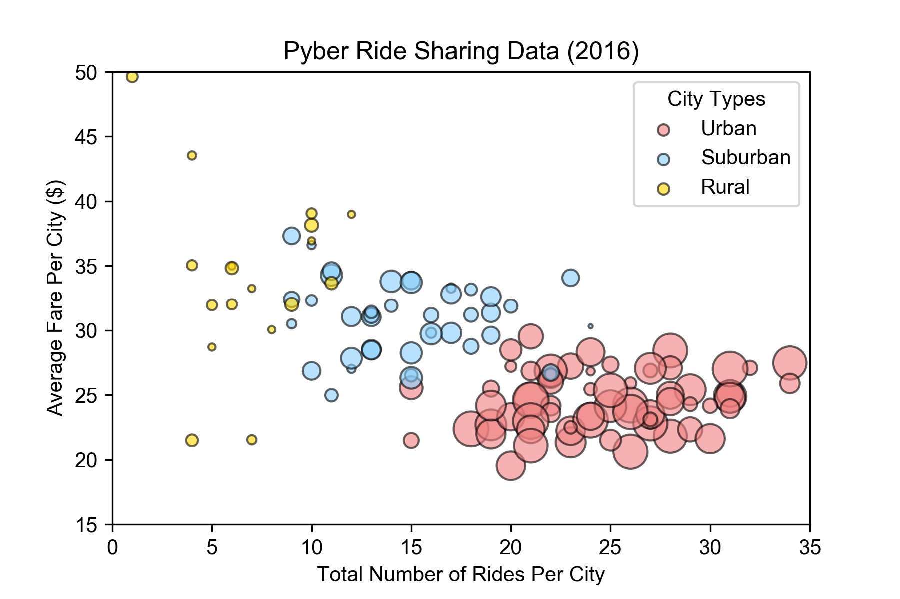
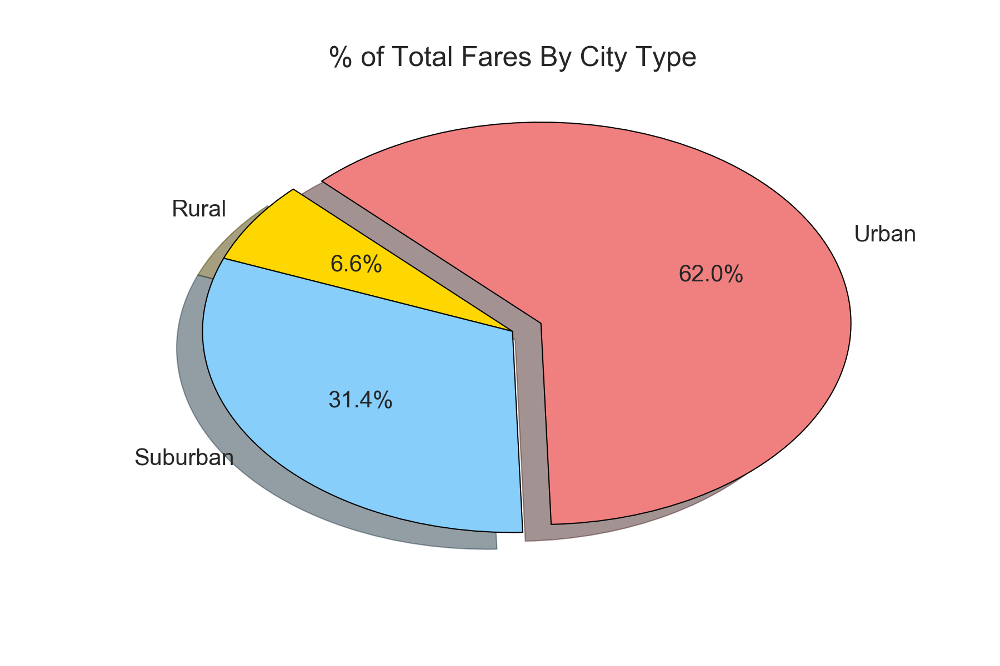
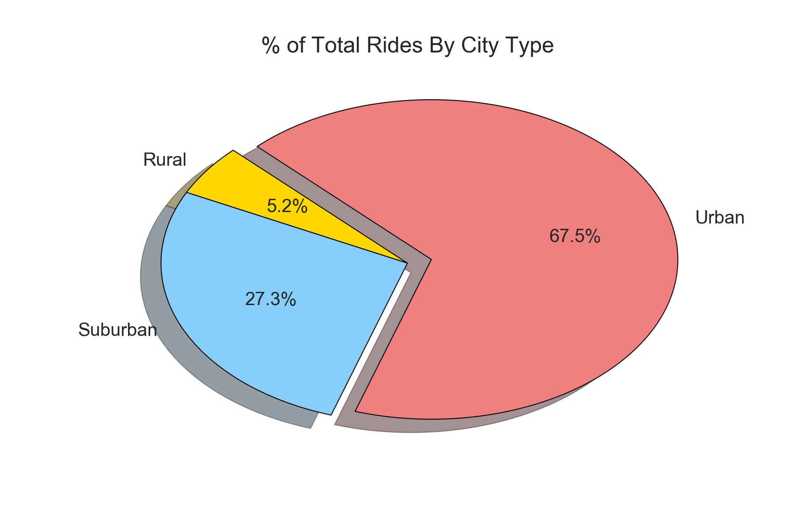
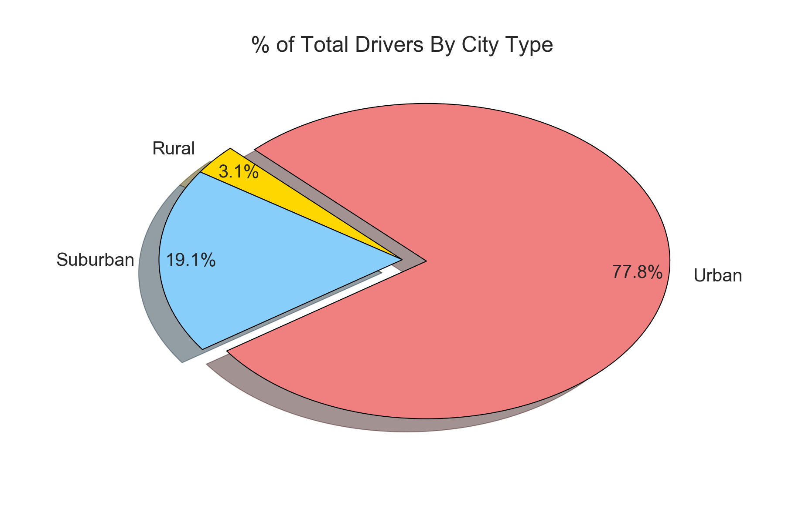

# Analysis

- **Observed Trend 1**: The majority of rides occur in urban locations, while the fewest rides occur in rural locations
- **Observed Trend 2**: The more rural an area, the more rides cost on average.
- **Observed Trend 3**: Most revenue (62 percent) is made in urban locations.

# Getting Started: Importing Dependencies and Data


```python
# Dependencies
import pandas as pd
import matplotlib.pyplot as plt
import numpy as np
import seaborn as sns
```


```python
# Read in CSVs with raw data
city_csv_path = 'raw_data/city_data.csv'
ride_csv_path = 'raw_data/ride_data.csv'

city_df = pd.read_csv(city_csv_path)
ride_df = pd.read_csv(ride_csv_path)
```


```python
# Preview city data
city_df.head()
```


<div>
<style>
    .dataframe thead tr:only-child th {
        text-align: right;
    }

    .dataframe thead th {
        text-align: left;
    }

    .dataframe tbody tr th {
        vertical-align: top;
    }
</style>
<table border="1" class="dataframe">
  <thead>
    <tr style="text-align: right;">
      <th></th>
      <th>city</th>
      <th>driver_count</th>
      <th>type</th>
    </tr>
  </thead>
  <tbody>
    <tr>
      <th>0</th>
      <td>Kelseyland</td>
      <td>63</td>
      <td>Urban</td>
    </tr>
    <tr>
      <th>1</th>
      <td>Nguyenbury</td>
      <td>8</td>
      <td>Urban</td>
    </tr>
    <tr>
      <th>2</th>
      <td>East Douglas</td>
      <td>12</td>
      <td>Urban</td>
    </tr>
    <tr>
      <th>3</th>
      <td>West Dawnfurt</td>
      <td>34</td>
      <td>Urban</td>
    </tr>
    <tr>
      <th>4</th>
      <td>Rodriguezburgh</td>
      <td>52</td>
      <td>Urban</td>
    </tr>
  </tbody>
</table>
</div>


```python
# Preview ride data
ride_df.head()
```


<div>
<style>
    .dataframe thead tr:only-child th {
        text-align: right;
    }

    .dataframe thead th {
        text-align: left;
    }

    .dataframe tbody tr th {
        vertical-align: top;
    }
</style>
<table border="1" class="dataframe">
  <thead>
    <tr style="text-align: right;">
      <th></th>
      <th>city</th>
      <th>date</th>
      <th>fare</th>
      <th>ride_id</th>
    </tr>
  </thead>
  <tbody>
    <tr>
      <th>0</th>
      <td>Sarabury</td>
      <td>2016-01-16 13:49:27</td>
      <td>38.35</td>
      <td>5403689035038</td>
    </tr>
    <tr>
      <th>1</th>
      <td>South Roy</td>
      <td>2016-01-02 18:42:34</td>
      <td>17.49</td>
      <td>4036272335942</td>
    </tr>
    <tr>
      <th>2</th>
      <td>Wiseborough</td>
      <td>2016-01-21 17:35:29</td>
      <td>44.18</td>
      <td>3645042422587</td>
    </tr>
    <tr>
      <th>3</th>
      <td>Spencertown</td>
      <td>2016-07-31 14:53:22</td>
      <td>6.87</td>
      <td>2242596575892</td>
    </tr>
    <tr>
      <th>4</th>
      <td>Nguyenbury</td>
      <td>2016-07-09 04:42:44</td>
      <td>6.28</td>
      <td>1543057793673</td>
    </tr>
  </tbody>
</table>
</div>


```python
ride_data = pd.merge(ride_df, city_df, on='city', how='left')
ride_data.head()
```


<div>
<style>
    .dataframe thead tr:only-child th {
        text-align: right;
    }

    .dataframe thead th {
        text-align: left;
    }

    .dataframe tbody tr th {
        vertical-align: top;
    }
</style>
<table border="1" class="dataframe">
  <thead>
    <tr style="text-align: right;">
      <th></th>
      <th>city</th>
      <th>date</th>
      <th>fare</th>
      <th>ride_id</th>
      <th>driver_count</th>
      <th>type</th>
    </tr>
  </thead>
  <tbody>
    <tr>
      <th>0</th>
      <td>Sarabury</td>
      <td>2016-01-16 13:49:27</td>
      <td>38.35</td>
      <td>5403689035038</td>
      <td>46</td>
      <td>Urban</td>
    </tr>
    <tr>
      <th>1</th>
      <td>South Roy</td>
      <td>2016-01-02 18:42:34</td>
      <td>17.49</td>
      <td>4036272335942</td>
      <td>35</td>
      <td>Urban</td>
    </tr>
    <tr>
      <th>2</th>
      <td>Wiseborough</td>
      <td>2016-01-21 17:35:29</td>
      <td>44.18</td>
      <td>3645042422587</td>
      <td>55</td>
      <td>Urban</td>
    </tr>
    <tr>
      <th>3</th>
      <td>Spencertown</td>
      <td>2016-07-31 14:53:22</td>
      <td>6.87</td>
      <td>2242596575892</td>
      <td>68</td>
      <td>Urban</td>
    </tr>
    <tr>
      <th>4</th>
      <td>Nguyenbury</td>
      <td>2016-07-09 04:42:44</td>
      <td>6.28</td>
      <td>1543057793673</td>
      <td>8</td>
      <td>Urban</td>
    </tr>
  </tbody>
</table>
</div>


# Bubble Plot of Ride Sharing Data


```python
# Group data by city to calculate average fare, number of rides,
# and driver count per city.
grouped_rides = ride_data.groupby('city')

# Start table with city name, driver count, and type for bubble plot,
# then add avg. fare and ride count. 
city_bubble_df = city_df[['city', 'driver_count', 'type']].set_index('city')
city_bubble_df['avg_fare'] = grouped_rides['fare'].mean()
city_bubble_df['ride_count'] = grouped_rides['city'].count()
city_bubble_df.head()
```


<div>
<style>
    .dataframe thead tr:only-child th {
        text-align: right;
    }

    .dataframe thead th {
        text-align: left;
    }

    .dataframe tbody tr th {
        vertical-align: top;
    }
</style>
<table border="1" class="dataframe">
  <thead>
    <tr style="text-align: right;">
      <th></th>
      <th>driver_count</th>
      <th>type</th>
      <th>avg_fare</th>
      <th>ride_count</th>
    </tr>
    <tr>
      <th>city</th>
      <th></th>
      <th></th>
      <th></th>
      <th></th>
    </tr>
  </thead>
  <tbody>
    <tr>
      <th>Kelseyland</th>
      <td>63</td>
      <td>Urban</td>
      <td>21.806429</td>
      <td>28</td>
    </tr>
    <tr>
      <th>Nguyenbury</th>
      <td>8</td>
      <td>Urban</td>
      <td>25.899615</td>
      <td>26</td>
    </tr>
    <tr>
      <th>East Douglas</th>
      <td>12</td>
      <td>Urban</td>
      <td>26.169091</td>
      <td>22</td>
    </tr>
    <tr>
      <th>West Dawnfurt</th>
      <td>34</td>
      <td>Urban</td>
      <td>22.330345</td>
      <td>29</td>
    </tr>
    <tr>
      <th>Rodriguezburgh</th>
      <td>52</td>
      <td>Urban</td>
      <td>21.332609</td>
      <td>23</td>
    </tr>
  </tbody>
</table>
</div>


```python
# Create bubble plot

# Add data to plot for urban locations.
urban = plt.scatter(city_bubble_df.loc[city_bubble_df['type']=='Urban', 'ride_count'],
                    city_bubble_df.loc[city_bubble_df['type']=='Urban', 'avg_fare'],
                    s=city_bubble_df.loc[city_bubble_df['type']=='Urban', 'driver_count']*4,
                    label='Urban', color='lightcoral', alpha=.6, edgecolor='black')

# Add data to plot for suburban locations.
suburban = plt.scatter(city_bubble_df.loc[city_bubble_df['type']=='Suburban', 'ride_count'],
                    city_bubble_df.loc[city_bubble_df['type']=='Suburban', 'avg_fare'],
                    s=city_bubble_df.loc[city_bubble_df['type']=='Suburban', 'driver_count']*4,
                    label='Suburban', color='lightskyblue', alpha=.6, edgecolor='black')

# Add data to plot for rural locations.
rural = plt.scatter(city_bubble_df.loc[city_bubble_df['type']=='Rural', 'ride_count'],
                    city_bubble_df.loc[city_bubble_df['type']=='Rural', 'avg_fare'],
                    s=city_bubble_df.loc[city_bubble_df['type']=='Rural', 'driver_count']*4,
                    label='Rural', color='gold', alpha=.6, edgecolor='black')

# Set x and y limits.
plt.xlim(0, 35)
plt.ylim(15, 50)

# Add a legend in the best location.
lgnd = plt.legend(handles=[urban, suburban, rural], loc='best', title='City Types')

# Set the marker sizes for each of the items in the legend.
lgnd.legendHandles[0]._sizes = [30]
lgnd.legendHandles[1]._sizes = [30]
lgnd.legendHandles[2]._sizes = [30]

# Add labels to the x and y axes and give the chart a title.
plt.xlabel('Total Number of Rides Per City')
plt.ylabel('Average Fare Per City ($)')
plt.title('Pyber Ride Sharing Data (2016)')

# Use seaborn library to set the grid background style.
sns.set_style('darkgrid')

# Add a note at the far right of the graph explaining what marker size indicates.
# 1 = far right, .5 = halfway up.
plt.gcf().text(1, 0.5, 'Note:\nCircle size correlates with driver count per city.', fontsize=11)
```


    Text(1,0.5,'Note:\nCircle size correlates with driver count per city.')


```python
# Save high res figure and display plot.
plt.savefig('Pyber_Data_Bubble_Chart.png', dpi=300)
plt.show()
```





# Pie Chart 1: Percent of Total Fares by City Type


```python
# Format a dataframe to use for developing pie charts
# that summarize data by city type.
city_types = ['Rural', 'Suburban', 'Urban']
colors = ['gold', 'lightskyblue', 'lightcoral']
city_groups = ride_data.groupby('type')
city_type_summary = pd.DataFrame(city_groups['fare'].sum()).rename(columns={'fare':'total_fares'})
city_type_summary['total_rides'] = city_groups['ride_id'].count()
city_type_summary['driver_count'] = city_df.groupby('type')['driver_count'].sum()
city_type_summary
```


<div>
<style>
    .dataframe thead tr:only-child th {
        text-align: right;
    }

    .dataframe thead th {
        text-align: left;
    }

    .dataframe tbody tr th {
        vertical-align: top;
    }
</style>
<table border="1" class="dataframe">
  <thead>
    <tr style="text-align: right;">
      <th></th>
      <th>total_fares</th>
      <th>total_rides</th>
      <th>driver_count</th>
    </tr>
    <tr>
      <th>type</th>
      <th></th>
      <th></th>
      <th></th>
    </tr>
  </thead>
  <tbody>
    <tr>
      <th>Rural</th>
      <td>4255.09</td>
      <td>125</td>
      <td>104</td>
    </tr>
    <tr>
      <th>Suburban</th>
      <td>20335.69</td>
      <td>657</td>
      <td>638</td>
    </tr>
    <tr>
      <th>Urban</th>
      <td>40078.34</td>
      <td>1625</td>
      <td>2607</td>
    </tr>
  </tbody>
</table>
</div>


```python
# Create a pie chart showing % of total fares by city type.
explode = [0, 0, .1]
plt.pie(city_type_summary['total_fares'], labels=city_types, colors=colors,
        explode=explode, shadow=True, startangle=135, autopct='%1.1f%%',
        wedgeprops={'linewidth':.5, 'edgecolor':'black'})
plt.title('% of Total Fares By City Type')
```


    Text(0.5,1,'% of Total Fares By City Type')


```python
# Save high res figure and display plot.
plt.savefig('Percent_Total_Fares_By_City_Type.png', dpi=300)
plt.show()
```





# Pie Chart 2: Percent of Total Rides by City Type


```python
# Create a pie chart showing % of total rides by city type.
explode = [0, 0, .1]
plt.pie(city_type_summary['total_rides'], labels=city_types, colors=colors,
        explode=explode, shadow=True, startangle=135, autopct='%1.1f%%',
        wedgeprops={'linewidth':.5, 'edgecolor':'black'})
plt.title('% of Total Rides By City Type')
```


    Text(0.5,1,'% of Total Rides By City Type')


```python
# Save high res figure and display plot.
plt.savefig('Percent_Total_Rides_By_City_Type.png', dpi=300)
plt.show()
```





# Pie Chart 3: Percent of Total Drivers by City Type


```python
# Create a pie chart showing % of total drivers by city type.
explode = [0, 0, .1]
plt.pie(city_type_summary['driver_count'], labels=city_types, colors=colors,
        explode=explode, shadow=True, startangle=135, autopct='%1.1f%%',
        wedgeprops={'linewidth':.5, 'edgecolor':'black'}, pctdistance=.87)
plt.title('% of Total Drivers By City Type')
```


    Text(0.5,1,'% of Total Drivers By City Type')


```python
# Save high res figure and display plot.
plt.savefig('Percent_Total_Drivers_By_City_Type.png', dpi=300)
plt.show()
```




