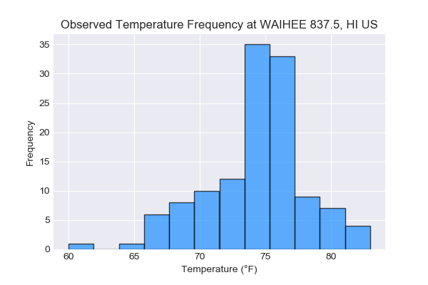
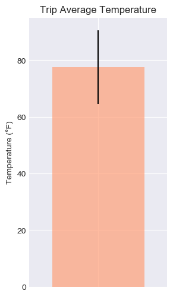

# File Guide
## data_engineering.ipynb
This file previews and cleans the raw data from the two CSVs in the 'Resources' folder. Clean measurement data is saved to a new CSV in the 'Resources' folder.
## database_engineering.ipynb
This file uses SQLAlchemy to model table schemas to contain data from each CSV and creates a SQLite database for these tables.
## climate_app.py
Creates a Flask API based on the climate_analysis.ipynb queries.
**Available Routes:**
- /api/v1.0/precipitation
- /api/v1.0/stations
- /api/v1.0/tobs
- /api/v1.0/start_date
- /api/v1.0/start_date/end_date

*Note: Enter dates in yyyy-mm-dd format.*
## climate_analysis.ipynb
Conducts the following analyses:
- Creates a bar chart showing precipitation observations from the past year

- Creates a histogram of observed temperature frequency at the station with the most observations.

- Calculate the minimum, average, and maximum temperatures for a planned vacation using the matching dates from the previous year (i.e. "2017-01-01" if the trip start date was "2018-01-01") and uses these values to create a bar chart.
